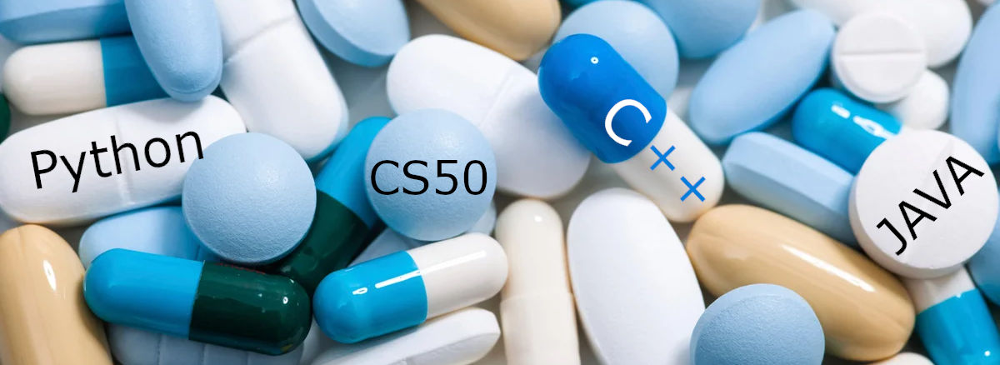

# The Geek drugs store content example


***

[](https://youtu.be/Yi_fcViY8C8)

## Admin panel - settings

***

### Global

Store name (title)

```
Geek drugs
```

Site icon - favicon.ico

```
get from img folder - geek-drugs.ico
```

Footer description

```
Copyright © 2020 - The Geek drugs store. All rights reserved. 
Content of this site may not be reproduced or used in any manner whatsoever without the express written permission of the owner.
```

### Main page

Main page header

```
Welcome to the Geek drugs!
```

Main page image

```
get from img folder - home.jpg
```

Main page description

```
Welcome to the geek drugs! We are engaged in the production of magic pills that will help you master one of 
several programming languages. Take a look at our great <a class="link-primary" href="catalog.html">product 
catalog</a>. We wish you a great choice &#128521;
```

### Contacts

Phone number

```
+1 400-333-2211
```

Email

```
info@geekdrugs.com
```

Address

```
1 Oxford St Cambridge, MA 02138
```

Google map

```
<iframe src="https://www.google.com/maps/embed?pb=!1m18!1m12!1m3!1d94360.28569190644!2d-71.10635425540302!3d42.347662831908785!2m3!1f0!2f0!3f0!3m2!1i1024!2i768!4f13.1!3m3!1m2!1s0x89e37743dfc81557%3A0x8f78b2c0b816fee0!2zMSBPeGZvcmQgU3QsIENhbWJyaWRnZSwgTUEgMDIxMzgsINCh0KjQkA!5e0!3m2!1sru!2sru!4v1609428445493!5m2!1sru!2sru" width="600" height="450" frameborder="0" style="border:0;" allowfullscreen="" aria-hidden="false" tabindex="0"></iframe>
```

## Admin panel - products - add new product

### 1-st product

Product name

```
Java beans
```

Price $

```
3500
```

Product header

```
Try this powerful magic beans!
```

Product instruction

```
The night before bed, brew a cup of coffee with these five beans and wake up as a Java connoisseur!
```

Product info

```
Java is a class-based, object-oriented programming language that is designed to have as few implementation dependencies as possible. It is a general-purpose programming language intended to let application developers write once, run anywhere (WORA),[17] meaning that compiled Java code can run on all platforms that support Java without the need for recompilation.[18] Java applications are typically compiled to bytecode that can run on any Java virtual machine (JVM) regardless of the underlying computer architecture. The syntax of Java is similar to C and C++, but has fewer low-level facilities than either of them.
```

Product image

```
get from img folder - java-beans.jpg
```

### 2-st product

Product name

```
C++ pills
```

Price $

```
1999
```

Product header

```
Discover new opportunities!
```

Product instruction

```
Take three pills every morning and in a week you will become a master of c++
```

Product info

```
C++ is a general-purpose programming language created by Bjarne Stroustrup as an extension of the C programming language, or "C with Classes". The language has expanded significantly over time, and modern C++ now has object-oriented, generic, and functional features in addition to facilities for low-level memory manipulation. It is almost always implemented as a compiled language, and many vendors provide C++ compilers, including the Free Software Foundation, LLVM, Microsoft, Intel, Oracle, and IBM, so it is available on many platforms.
```

Product image

```
get from img folder - cpp-pills.jpg
```

### 3-st product

Product name

```
Python blood
```

Price $

```
777
```

Product header

```
The fastest way to become a programmer!
```

Product instruction

```
Drink three liters of python blood, open your eyes and feel your new strength.
```

Product info

```
Python is an interpreted, high-level and general-purpose programming language. Python's design philosophy emphasizes code readability with its notable use of significant whitespace. Its language constructs and object-oriented approach aim to help programmers write clear, logical code for small and large-scale projects. Python is dynamically typed and garbage-collected. It supports multiple programming paradigms, including structured (particularly, procedural), object-oriented, and functional programming. Python is often described as a "batteries included" language due to its comprehensive standard library.
```

Product image

```
get from img folder - python.jpg
```